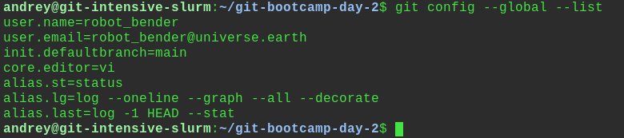
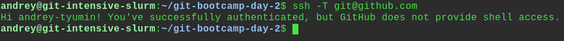
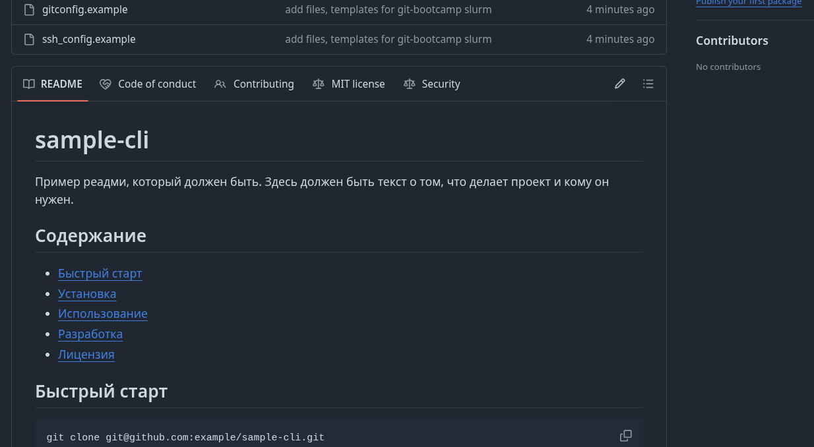
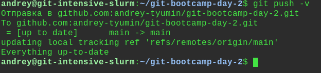
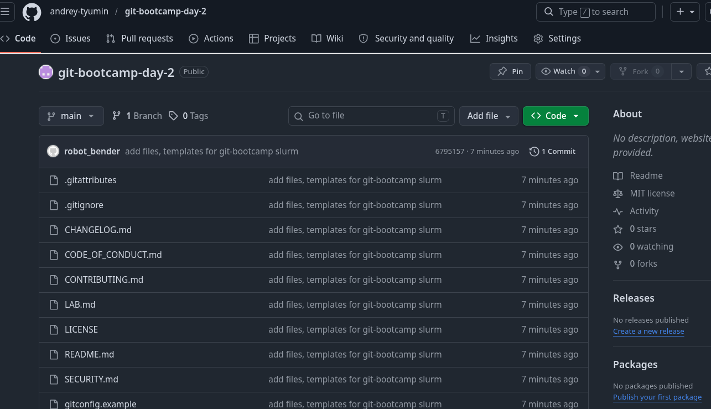

<!--
Шаблон отчёта по ДЗ дня 2.
Скопируйте этот файл в корень своего репозитория `git-bootcamp-day-2` под именем `LAB.md` и заполните.
Удалите этот HTML-комментарий перед коммитом.
Места `<...>` — заменяйте на свои значения. Места `[FIXME: ...]` — это подсказки, что написать.
-->

# LAB — день 2

Отчёт о выполнении домашнего задания дня 2 в рамках курса ["Интенсив по погружению в GIT"](https://slurm.io/git-intensive): настройка `gitconfig` и SSH, создание публичного репозитория, наполнение его служебными и стандартными файлами.

## Содержание

- [LAB — день 2](#lab--день-2)
  - [Содержание](#содержание)
  - [Настройка gitconfig](#настройка-gitconfig)
  - [SSH-ключ и подключение к GitHub](#ssh-ключ-и-подключение-к-github)
  - [Создание репозитория](#создание-репозитория)
  - [Служебные файлы](#служебные-файлы)
    - [`.gitignore`](#gitignore)
    - [`.gitattributes`](#gitattributes)
  - [Стандартные файлы и выбор лицензии](#стандартные-файлы-и-выбор-лицензии)
    - [Почему именно эта лицензия](#почему-именно-эта-лицензия)
  - [Markdown](#markdown)
  - [Финальный пуш](#финальный-пуш)

## Настройка gitconfig


Настраивал: user.name, user.email, init.defaultBranch, core.editor.
Параметры все случайны.
алиасы:
        st = status
        lg = log --oneline --graph --all --decorate
        last = log -1 HEAD --stat

Скриншот вывода `git config --global --list`:



Полный фрагмент моего конфига — в файле [`gitconfig.example`](gitconfig.example).

## SSH-ключ и подключение к GitHub

использовал алгоритм: ed25519

Скриншот ответа GitHub на `ssh -T git@github.com`:



Фрагмент моего `~/.ssh/config` — в файле [`ssh_config.example`](ssh_config.example).

## Создание репозитория

Видимость выбрал public. 
Собирал локально, потом пушил, LAB.md редактировал уже в UI через stackedit.io.
Скриншот свежесозданного репозитория:



## Служебные файлы

### `.gitignore`

Стек: `<Python>`. Выбрал, потому что чуть-чуть его знаю.

За основу взял шаблон с `https://www.toptal.com/developers/gitignore/api/python.

### `.gitattributes`

Минимум — `* text=auto` для нормализации переносов строк между macOS/Linux и Windows. Дополнительные правила:

```text
* text=auto
*.sh text eol=lf
*.py text eol=lf
*.js text eol=lf
*.ts text eol=lf
*.yml text eol=lf
*.yaml text eol=lf
*.png binary
```

## Стандартные файлы и выбор лицензии

В корне лежат:

- [`README.md`](README.md) — визитка проекта.
- [`CHANGELOG.md`](CHANGELOG.md) — формат Keep a Changelog.
- [`LICENSE`](LICENSE) — выбранная лицензия.
- [`CONTRIBUTING.md`](CONTRIBUTING.md) — как контрибьютить.
- [`CODE_OF_CONDUCT.md`](CODE_OF_CONDUCT.md) — Contributor Covenant.
- [`SECURITY.md`](SECURITY.md) — политика раскрытия уязвимостей.

### Почему именно эта лицензия

Выбрал MIT т.к. она показалась мне наиболее практичной.
Ссылка на дерево решений: https://choosealicense.com/]

## Markdown


В этом отчёте и в `README.md` использованы:

- заголовки `H1`/`H2`/`H3`;
- оглавление в начале со ссылками на якоря;
- блоки кода с подсветкой (`bash`, `text`);
- сворачиваемый блок (см. ниже);
- ссылки на внешние URL.

<details>
<summary>Пример сворачиваемого блока (можно убрать после проверки)</summary>

free -h  
swapoff -a  
swapon -a  

</details>

## Финальный пуш

Пушил на майн.

Терминал с пушем:



Главная страница репозитория после пуша:


